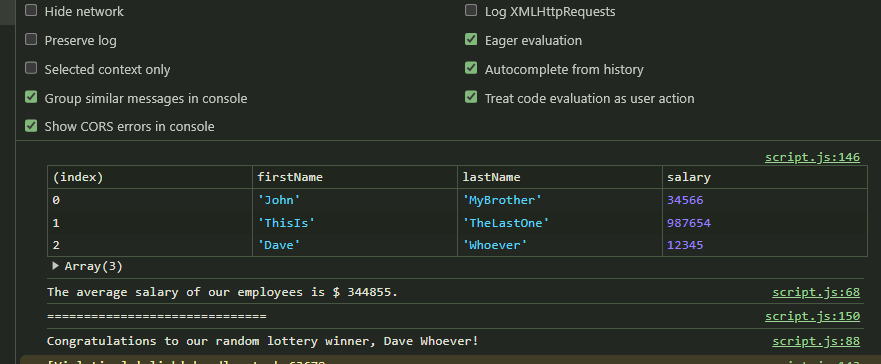

# Employee Payroll Tracker
### Dave Butterworth - Javascript (Module 3 Challenge)

## Application Purpose
This application is an employee payroll tracker designed to allow the data entry of an employee’s first and last name and their corresponding salary.  The entries will then be displayed in a tabular format in alphabetical order, by last name, and will include the salary for each employee.

## Scope of Development Work
This developer was tasked with proving the input definition and coding for the application.  Starter code already provided the actual table construct and formatting, including salary display conversion to $USD.  

## Specific Requirements Criteria
The following images are provided to allow customer to see the interface and output provided by this application.

### User Start Page

-User will be presented with page with a template that offers a button labeled “Add Employee”.

### Date Input Prompt

-User will then be presented with a box asking for input for the employee’s first name, then one for the last name, and finally for the salary.

### Continue Input Query

-After the salary input, the user will then be presented with a box asking if they wish to enter another employee.  
-If user selects to continue, then the same questions for the next employee will follow.

### Final Web Page Display

-If the user elects to cancel, then they will be presented with a table showing the employee information that has been entered to that point.

### Console Data Displayed

-Additional functionality is provided without direct web browser output but will be visible through a terminal console.
	-Average salary will be computed and displayed in the console window.
	-A random employee’s information will be displayed in the console window.

## Functions Convention
The functions below were created as per the user’s requirements, and in this application, the functions had to be integrated with the starter code which could not be changed. This meant that the functions that I created were needed by the starter code and had to work with the functions calls and variable naming that was present in the starter code.

## Three main functions
There are 3 named functions called by the starter code:

### `collectEmployees`
This function provides the user with input prompts and captures the data for each employee.

### `displayAverageSalary`
This function computes the average salary of all the employees entered by the user. The output is displayed only in the console window.
### `getRandomEmployee`
This generates a random number and returns the employee’s first name and last name using the random number as the index value.  This also congratulates the random employee as the winner of a random lottery. This output is displayed only in the console window.

## Deployment and Repository
The repository for this application is located at URL:
https://github.com/AeroRider66/Module-3-Challenge

Deployed page URL:
https://aerorider66.github.io/Module-3-Challenge/

 
 
**References:**
Help and explanation from Samuel Wlodawski provided me with a greater understanding of the logical coding on the conditional `while` input loop from Samuel Wlodawski.  He explained my how I could do an iterative input from the user, and build the employeesArray from that.  Additionally, he called attention to the fact that the array captured the salary as a string and not a number.

Random number generator from MDN web docs for Math.random() built-ins
https://developer.mozilla.org/en-US/docs/Web/JavaScript/Reference/Global_Objects/Math/random
